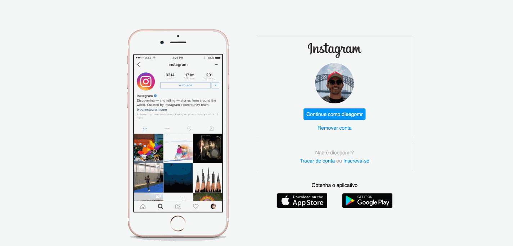

<h1>Instagram-Landing-Page</h1>

Esse é um desafio de projeto para o Bootcamp Spread Fullstack Web Developer, onde o desafio era recriar a Landing Page do Instagram com um design responsivo.

<h3>Tecnologias Utilizadas:</h3>
<ul>
    <li>Javascript</li>
    <li>HTML</li>
    <li>CSS</li>
</ul>

<h3>Prévia:</h3>
<h1 align="center">
    
</h1>

